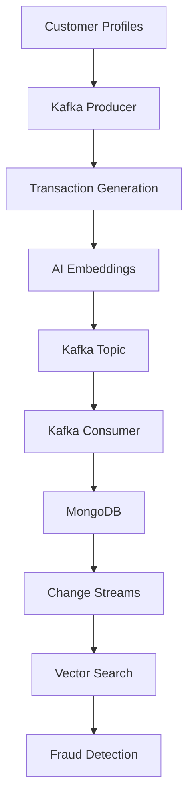

# 🛡️ Real-Time AI Fraud Detection System

[](https://openjdk.org/projects/jdk/21/)
[](https://spring.io/projects/spring-boot)
[](https://www.mongodb.com/atlas)
[](https://kafka.apache.org/)
[](https://openai.com/)

A sophisticated real-time fraud detection system that leverages **MongoDB Atlas Vector Search**, **Apache Kafka**, and **AI-generated embeddings** to identify suspicious financial transactions in real-time. The system analyzes user transaction patterns and detects anomalies using AI embeddings and vector similarity search.

## 🏗️ Architecture Overview



## ✨ Key Features

- **🔄 Real-time Processing**: Instant fraud detection using MongoDB Change Streams
- **🤖 AI-Powered Analysis**: OpenAI embeddings for semantic transaction comparison
- **📊 Vector Search**: MongoDB Atlas Vector Search for similarity detection
- **⚡ Event-Driven Architecture**: Apache Kafka for scalable message processing
- **📈 Synthetic Data Generation**: Realistic customer profiles and transaction patterns
- **🎯 Anomaly Detection**: Flags transactions that deviate from user behavior patterns

## 🚀 How It Works

### 1. **Customer Profile Generation**
- Creates synthetic users with predictable spending habits
- Defines trusted merchants, categories, and spending patterns
- Stores profiles in MongoDB for baseline comparison

### 2. **Transaction Processing Pipeline**
- **Producer**: Generates transactions → Kafka
- **Consumer**: Reads from Kafka → Stores in MongoDB
- **Monitor**: Change Streams detect new transactions in real-time
- **Analysis**: Vector search compares against historical patterns

### 3. **Fraud Detection Logic**
A transaction is flagged as fraudulent if:
- ❌ No similar transactions exist for that user
- ⚠️ Similar transactions are already marked as fraud
- 🔍 Transaction deviates significantly from user patterns

## 🛠️ Technology Stack

| Component | Technology | Purpose |
|-----------|------------|---------|
| **Backend** | Spring Boot 3.4.2 | Application framework |
| **Database** | MongoDB Atlas | Document storage & vector search |
| **Messaging** | Apache Kafka 3.5+ | Real-time event streaming |
| **AI/ML** | OpenAI API | Text embeddings generation |
| **Language** | Java 21 | Core development language |
| **Build Tool** | Maven 3.9+ | Dependency management |

## 📋 Prerequisites

Before running this project, ensure you have:

- ☕ **Java 21** installed and configured
- 🗄️ **MongoDB Atlas** account with M0+ cluster
- 🔧 **Apache Kafka 3.5+** (local or Docker)
- 🤖 **OpenAI API key** for embeddings
- 🏗️ **Maven 3.9+** for building the project

## ⚙️ Installation & Setup

### 1. Clone the Repository
```bash
git clone https://github.com/your-username/fraud-detection-system.git
cd fraud-detection-system
```

### 2. Configure MongoDB Atlas
1. Create a free MongoDB Atlas account
2. Set up an M0 cluster
3. Create database: `fraud`
4. Create collections: `customers`, `transactions`

### 3. Set Up Vector Search Index
Navigate to **MongoDB Atlas → Collections → transactions → Atlas Search**

Create a Vector Search index with this configuration:
```json
{
  "fields": [
    {
      "type": "vector",
      "path": "embedding",
      "numDimensions": 1536,
      "similarity": "dotProduct"
    }
  ]
}
```

### 4. Configure Application Properties
Update `src/main/resources/application.properties`:

```properties
# Application
spring.application.name=frauddetector

# MongoDB Configuration
spring.data.mongodb.uri=<YOUR_MONGODB_CONNECTION_STRING>
spring.data.mongodb.database=fraud

# OpenAI Configuration
spring.ai.openai.api-key=<YOUR_OPENAI_API_KEY>
spring.ai.openai.embedding.options.model=text-embedding-3-small

# Kafka Configuration
spring.kafka.bootstrap-servers=localhost:9092
spring.kafka.producer.key-serializer=org.apache.kafka.common.serialization.StringSerializer
spring.kafka.producer.value-serializer=org.springframework.kafka.support.serializer.JsonSerializer
spring.kafka.consumer.bootstrap-servers=localhost:9092
spring.kafka.consumer.group-id=fraud-group
spring.kafka.consumer.auto-offset-reset=earliest
spring.kafka.consumer.key-deserializer=org.apache.kafka.common.serialization.StringDeserializer
spring.kafka.consumer.value-deserializer=org.springframework.kafka.support.serializer.JsonDeserializer
spring.kafka.consumer.properties.spring.json.trusted.packages=com.mongodb.frauddetector.model
```

### 5. Start Apache Kafka

#### Initialize Kafka (first time only):
```bash
export KAFKA_CLUSTER_ID="$(bin/kafka-storage.sh random-uuid)"
bin/kafka-storage.sh format --standalone -t $KAFKA_CLUSTER_ID -c config/server.properties
```

#### Start Kafka Broker:
```bash
bin/kafka-server-start.sh config/server.properties
```

#### Create Transactions Topic:
```bash
bin/kafka-topics.sh --create \
  --topic transactions \
  --bootstrap-server localhost:9092 \
  --partitions 1 \
  --replication-factor 1
```

### 6. Build and Run the Application
```bash
mvn clean spring-boot:run
```

## 📊 Project Structure

```
src/main/java/com/mongodb/frauddetector/
├── 📁 config/           # Configuration classes
│   ├── MongoDBConfig.java
│   └── OpenAIConfig.java
├── 📁 enums/            # Enumeration types
│   ├── Category.java
│   ├── Currency.java
│   └── Merchant.java
├── 📁 model/            # Data models
│   ├── Customer.java
│   └── Transaction.java
├── 📁 repository/       # Data access layer
│   ├── CustomerRepository.java
│   └── TransactionRepository.java
├── 📁 service/          # Business logic
│   ├── CustomerSeeder.java
│   ├── EmbeddingGenerator.java
│   ├── TransactionChangeStreamListener.java
│   ├── TransactionConsumer.java
│   ├── TransactionProducer.java
│   ├── TransactionSeeder.java
│   └── TransactionVectorSearchService.java
└── FrauddetectorApplication.java
```

