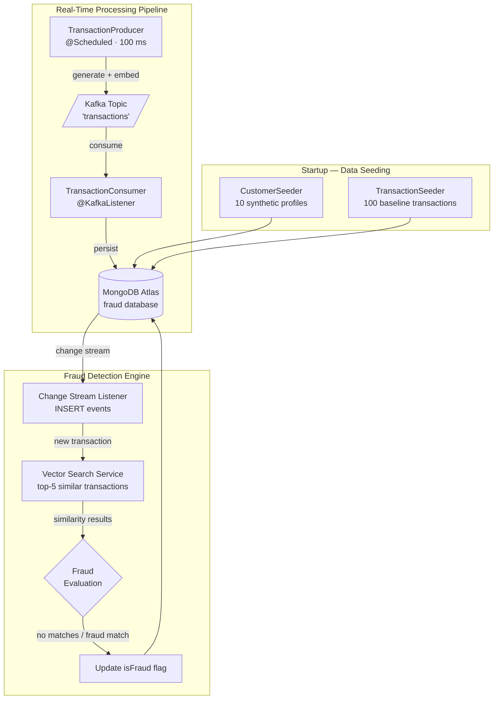

# Fraud Detection System

<div align="center">

[](https://openjdk.org/projects/jdk/21/)
[](https://spring.io/projects/spring-boot)
[](https://www.mongodb.com/atlas)
[](https://kafka.apache.org/)
[](https://openai.com/)
[](https://www.docker.com/)
[](https://aws.amazon.com/ecs/)

A real-time, AI-powered fraud detection system that combines event-driven architecture with semantic vector search to identify suspicious financial transactions at scale.

</div>

---

## Overview

This system continuously monitors financial transactions by generating AI embeddings for each transaction and comparing them against historical behavior patterns using **MongoDB Atlas Vector Search**. When a new transaction arrives, the system checks its semantic similarity against prior transactions for the same user — flagging it as fraudulent if no similar patterns exist or if similar transactions were previously identified as fraudulent.

**Core capabilities:**
- Real-time transaction processing via Apache Kafka event streaming
- Semantic analysis using OpenAI `text-embedding-3-small` (1536-dimensional vectors)
- Approximate nearest-neighbor search with MongoDB Atlas Vector Search
- Change Data Capture (CDC) via MongoDB Change Streams for instant reaction to new data
- Synthetic data generation for a realistic baseline of customer spending profiles

---

## Architecture


```mermaid
flowchart TB
    subgraph Startup["Startup — Data Seeding"]
        CS[CustomerSeeder\n10 synthetic profiles]
        TS[TransactionSeeder\n100 baseline transactions]
    end

    subgraph Pipeline["Real-Time Processing Pipeline"]
        direction LR
        P["TransactionProducer\n@Scheduled · 100 ms"]
        K[/"Kafka Topic\n'transactions'"/]
        C["TransactionConsumer\n@KafkaListener"]
        DB[(MongoDB Atlas\nfraud database)]

        P -->|"generate + embed"| K
        K -->|consume| C
        C -->|persist| DB
    end

    subgraph Detection["Fraud Detection Engine"]
        direction LR
        CDC["Change Stream Listener\nINSERT events"]
        VS["Vector Search Service\ntop-5 similar transactions"]
        FD{"Fraud\nEvaluation"}
        UP[Update isFraud flag]

        CDC -->|"new transaction"| VS
        VS -->|similarity results| FD
        FD -->|"no matches / fraud match"| UP
        UP --> DB
    end

    CS & TS --> DB
    DB -->|change stream| CDC
```

### Data Flow

| Step | Component | Description |
|------|-----------|-------------|
| 1 | **CustomerSeeder** | Seeds 10 synthetic customer profiles with trusted merchants, categories, and spending stats |
| 2 | **TransactionSeeder** | Generates 100 baseline transactions (10 per customer) as a historical reference |
| 3 | **TransactionProducer** | Scheduled every 100 ms — generates a random transaction, creates an OpenAI embedding, publishes to Kafka |
| 4 | **TransactionConsumer** | Kafka listener — consumes messages and persists transactions to MongoDB |
| 5 | **Change Stream Listener** | Watches the `transactions` collection for INSERT events in real-time |
| 6 | **Vector Search Service** | Runs an Atlas Vector Search query to find the 5 most similar transactions for the same user |
| 7 | **Fraud Evaluation** | Flags the transaction as fraudulent if no similar transactions are found, or if any match is already marked as fraud |

---

## Tech Stack

| Layer | Technology | Version |
|-------|-----------|---------|
| Language | Java | 21 |
| Framework | Spring Boot | 3.5.0 |
| AI Integration | Spring AI | 1.0.0 |
| Embedding Model | OpenAI `text-embedding-3-small` | 1536 dimensions |
| Database | MongoDB Atlas | Vector Search + Change Streams |
| Messaging | Apache Kafka | 3.5+ |
| Serialization | Jackson | (managed by Spring Boot) |
| Build | Maven | 3.9+ |
| Containerization | Docker | Multi-stage build |
| Cloud | AWS ECS Fargate + ECR | — |
| CI/CD | GitHub Actions | — |

---

## Project Structure

```
src/main/java/com/email/aifrauddetection/
├── config/
│   ├── MongoDBConfig.java                   # MongoDatabase and collection beans
│   └── OpenAIConfig.java                    # OpenAI embedding model configuration
├── enums/
│   ├── Category.java                        # RETAIL, TECH, GROCERY
│   ├── Currency.java                        # EUR, USD, GBP
│   └── Merchant.java                        # 14 categorised merchants
├── model/
│   ├── Customer.java                        # Customer spending profile
│   └── Transaction.java                     # Transaction document with embedding
├── repository/
│   ├── CustomerRepository.java              # Spring Data MongoDB — customers
│   └── TransactionRepository.java           # Spring Data MongoDB — transactions
├── service/
│   ├── CustomerSeeder.java                  # Seeds baseline customer data on startup
│   ├── TransactionSeeder.java               # Seeds baseline transaction history on startup
│   ├── EmbeddingGenerator.java              # Generates OpenAI vector embeddings
│   ├── TransactionProducer.java             # Scheduled Kafka producer
│   ├── TransactionConsumer.java             # Kafka consumer — persists to MongoDB
│   ├── TransactionChangeStreamListener.java # MongoDB CDC — triggers fraud analysis
│   └── TransactionVectorSearchService.java  # Atlas Vector Search + fraud evaluation
└── AiFraudDetectionApplication.java
```

---

## Fraud Detection Logic

A transaction is marked as **fraudulent** when any of the following conditions are met:

1. **No historical match** — no similar transactions are found for that user (new or anomalous pattern)
2. **Fraud pattern match** — at least one of the top-5 similar transactions is already flagged as fraud

The embedding is generated from a composite string of: `userId + amount + currency + merchant + category`, which captures the full behavioral context of each transaction.

---

## Prerequisites

- **Java 21** — [Download OpenJDK](https://adoptium.net/)
- **Maven 3.9+** — [Download Maven](https://maven.apache.org/download.cgi)
- **MongoDB Atlas** — Free M0 cluster with Vector Search enabled
- **Apache Kafka 3.5+** — Local installation or Docker
- **OpenAI API key** — [platform.openai.com](https://platform.openai.com/)

---

## Getting Started

### 1. Clone the repository

```bash
git clone https://github.com/chouket0102/Fraud-Detection-System.git
cd Fraud-Detection-System
```

### 2. Set up MongoDB Atlas

1. Create a free account at [mongodb.com/atlas](https://www.mongodb.com/atlas)
2. Deploy an M0 cluster and obtain your connection string
3. Create a database named `fraud` with collections: `customers`, `transactions`
4. Navigate to **Atlas Search → Create Index** on the `transactions` collection and create a **Vector Search** index:

```json
{
  "fields": [
    {
      "type": "vector",
      "path": "embedding",
      "numDimensions": 1536,
      "similarity": "dotProduct"
    }
  ]
}
```

### 3. Configure application properties

Edit `src/main/resources/application.properties`:

```properties
spring.application.name=ai-fraud-detection

# MongoDB
spring.data.mongodb.uri=<YOUR_MONGODB_CONNECTION_STRING>
spring.data.mongodb.database=fraud

# OpenAI
spring.ai.openai.api-key=<YOUR_OPENAI_API_KEY>
spring.ai.openai.embedding.options.model=text-embedding-3-small

# Kafka
spring.kafka.bootstrap-servers=localhost:9094
spring.kafka.producer.key-serializer=org.apache.kafka.common.serialization.StringSerializer
spring.kafka.producer.value-serializer=org.springframework.kafka.support.serializer.JsonSerializer
spring.kafka.consumer.bootstrap-servers=localhost:9094
spring.kafka.consumer.group-id=fraud-group
spring.kafka.consumer.auto-offset-reset=earliest
spring.kafka.consumer.key-deserializer=org.apache.kafka.common.serialization.StringDeserializer
spring.kafka.consumer.value-deserializer=org.springframework.kafka.support.serializer.ErrorHandlingDeserializer
spring.kafka.consumer.properties.spring.deserializer.value.delegate.class=org.springframework.kafka.support.serializer.JsonDeserializer
spring.kafka.consumer.properties.spring.json.trusted.packages=com.email.aifrauddetection.model
spring.kafka.consumer.properties.spring.json.value.default.type=com.email.aifrauddetection.model.Transaction
```

### 4. Start Apache Kafka

**Initialize Kafka (first time only):**
```bash
export KAFKA_CLUSTER_ID="$(bin/kafka-storage.sh random-uuid)"
bin/kafka-storage.sh format --standalone -t $KAFKA_CLUSTER_ID -c config/server.properties
```

**Start the broker:**
```bash
bin/kafka-server-start.sh config/server.properties
```

**Create the transactions topic:**
```bash
bin/kafka-topics.sh --create \
  --topic transactions \
  --bootstrap-server localhost:9094 \
  --partitions 1 \
  --replication-factor 1
```

### 5. Build and run

```bash
# Run directly with Maven
mvn clean spring-boot:run

# Or build a JAR and run it
mvn clean package -DskipTests
java -jar target/ai-fraud-detection-0.0.1-SNAPSHOT.jar
```

The application starts on `http://localhost:8080`.

---

## Docker

A multi-stage `Dockerfile` is included. The build stage uses Maven 3.9.9 + Eclipse Temurin 21; the runtime stage uses Alpine Linux + OpenJDK 21 for a minimal image.

```bash
# Build the image
docker build -t fraud-detection-app:latest .

# Run the container
docker run -d \
  -p 8080:8080 \
  -e SPRING_DATA_MONGODB_URI="<YOUR_MONGODB_CONNECTION_STRING>" \
  -e SPRING_AI_OPENAI_API_KEY="<YOUR_OPENAI_API_KEY>" \
  -e SPRING_KAFKA_BOOTSTRAP_SERVERS="<KAFKA_HOST>:9094" \
  fraud-detection-app:latest
```

---

## AWS Deployment

The repository includes a `Makefile` and shell scripts under `scripts/` that automate provisioning on AWS ECS Fargate:

```bash
make help            # List all available targets
make deploy-init     # Full infrastructure setup (VPC, ECS cluster, IAM roles, parameters)
make build-push      # Build Docker image and push to Amazon ECR
make task-register   # Register an ECS task definition
make service-create  # Create the ECS service
make get-task-ip     # Retrieve the public IP of the running task
```

Secrets (MongoDB URI, OpenAI API key) are stored in **AWS Secrets Manager** and injected as environment variables at runtime. Logs are forwarded to **Amazon CloudWatch**.

---

## Contributing

1. Fork the repository
2. Create a feature branch: `git checkout -b feature/your-feature`
3. Commit your changes: `git commit -m "feat: describe your change"`
4. Push to your fork and open a pull request
